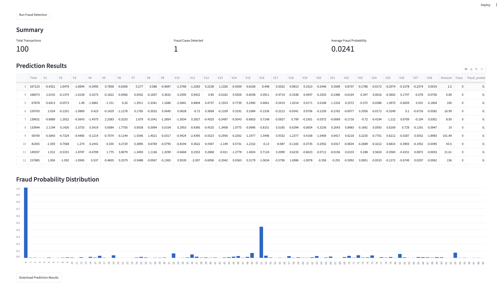
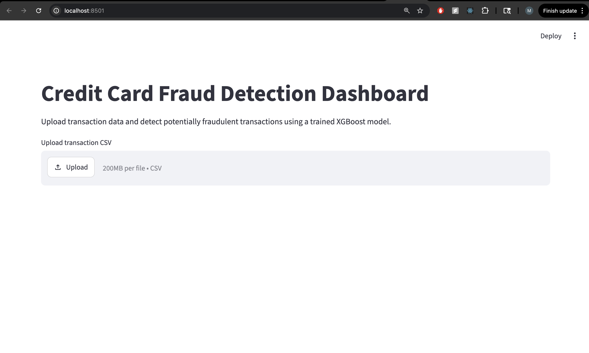
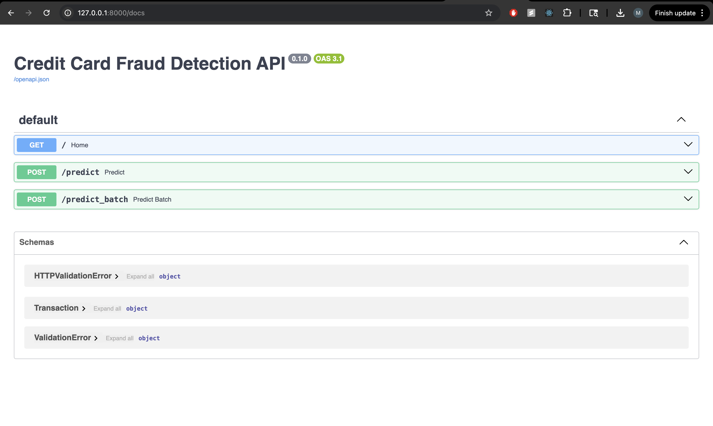

# Credit Card Fraud Detection System

An end-to-end machine learning application that detects potentially fraudulent credit card transactions using **XGBoost**, **FastAPI**, and **Streamlit**.

This project goes beyond a basic ML notebook by adding a REST API, batch prediction, an interactive dashboard, and downloadable prediction results.

## Features

- Trained XGBoost model on 284K+ credit card transactions
- Achieved 0.98 ROC-AUC on test data
- FastAPI backend for real-time and batch predictions
- Streamlit dashboard for CSV upload and fraud scoring
- Batch prediction endpoint for faster inference
- Fraud probability visualization
- Downloadable prediction results as CSV

## Tech Stack

- Python
- Pandas
- Scikit-learn
- XGBoost
- FastAPI
- Streamlit
- Joblib
- Matplotlib

## Project Architecture

```text
CSV Transaction Data
        ↓
Streamlit Dashboard
        ↓
FastAPI REST API
        ↓
XGBoost Fraud Detection Model
        ↓
Fraud Probability + Prediction
```

## Project Structure

```text
fraud-detection-ml/
├── dashboard/
│   └── app.py
├── data/
│   └── creditcard.csv
├── models/
├── notebooks/
│   └── exploration.ipynb
├── src/
│   ├── api.py
│   ├── predict.py
│   └── train.py
├── requirements.txt
├── Dockerfile
├── .gitignore
└── README.md
```

## Model Performance

The model was trained on the Kaggle Credit Card Fraud Detection dataset containing over **284,000 transactions**. Since fraudulent transactions are extremely rare, ROC-AUC and fraud recall are more meaningful evaluation metrics than overall accuracy.

| Metric          |  Score |
| --------------- | -----: |
| ROC-AUC         | 0.9803 |
| Fraud Precision |   0.35 |
| Fraud Recall    |   0.87 |
| Fraud F1-Score  |   0.50 |

## How to Run Locally

### 1. Clone the repository

```bash
git clone https://github.com/Muhayminalam/fraud-detection-ml.git
cd fraud-detection-ml
```

### 2. Install dependencies

```bash
pip install -r requirements.txt
```

### 3. Download the dataset

Download the Credit Card Fraud Detection dataset from Kaggle and place the CSV file in:

```text
data/creditcard.csv
```

> **Note:** The dataset is not included in this repository because of its size and Kaggle's distribution terms.

### 4. Train the model

```bash
python3 src/train.py
```

This generates:

```text
models/fraud_model.pkl
models/features.pkl
```

### 5. Start the FastAPI server

```bash
python3 -m uvicorn src.api:app --reload
```

Open:

```text
http://127.0.0.1:8000/docs
```

### 6. Start the Streamlit dashboard

Open a new terminal and run:

```bash
streamlit run dashboard/app.py
```

Then open:

```text
http://localhost:8501
```

## API Endpoints

### Health Check

```http
GET /
```

Returns:

```json
{
  "message": "Fraud Detection API is running"
}
```

---

### Predict a Single Transaction

```http
POST /predict
```

Returns:

```json
{
  "fraud_probability": 0.0347,
  "is_fraud": 0
}
```

---

### Predict Multiple Transactions

```http
POST /predict_batch
```

Returns:

```json
{
  "predictions": [
    {
      "fraud_probability": 0.0347,
      "is_fraud": 0
    },
    {
      "fraud_probability": 0.9121,
      "is_fraud": 1
    }
  ]
}
```

## Application Preview

### Streamlit Dashboard



### Prediction Results



### FastAPI Documentation


